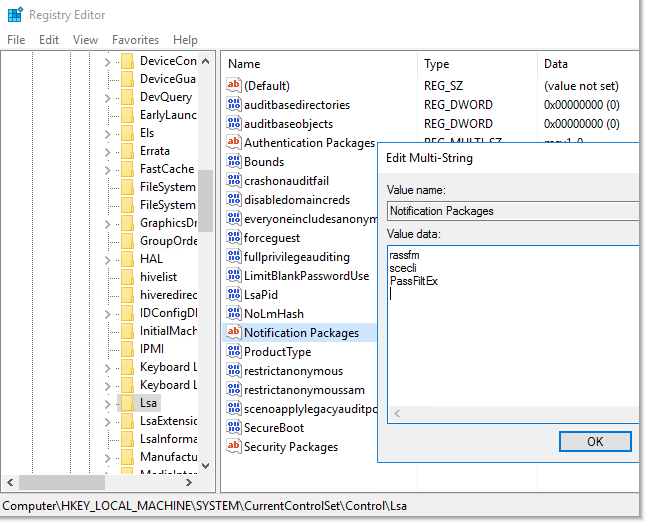
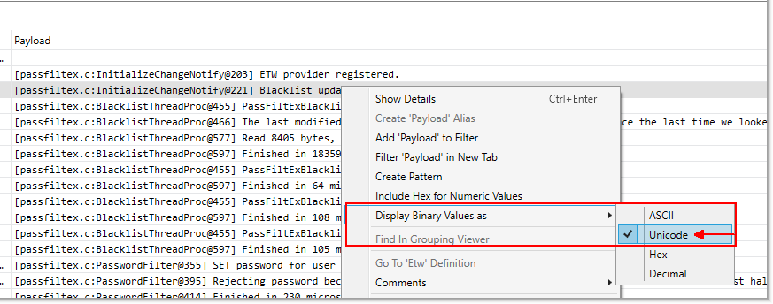
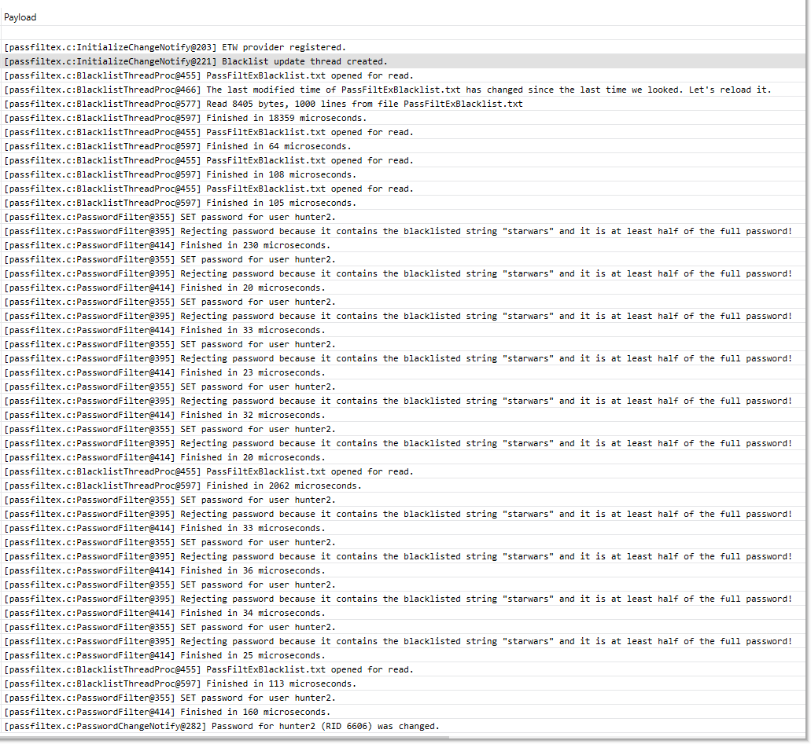

PassFiltEx.c

# PassFiltEx by Joseph Ryan Ries

Author: Joseph Ryan Ries 2018 <ryanries09@gmail.com> <ryan.ries@microsoft.com>

A password filter for Active Directory that uses a blacklist of bad passwords/character sequences.

Reference: https://msdn.microsoft.com/en-us/library/windows/desktop/ms721882(v=vs.85).aspx

********************************************************************************************
# READ ME

This is a personal project and is not in any way endorsed or supported by Microsoft.

Use at your own risk. This code is not guaranteed to be free of errors, and comes

with no guarantees, liability, warranties or support.

********************************************************************************************

I wrote this just to join the club of people who can say that they've done it.

Installation:

- Copy PassFiltEx.dll into the C:\Windows\System32 (or %SystemRoot%\System32) directory.

- Copy the PassFiltExBlacklist.txt file into the C:\Windows\System32 (or %SystemRoot%\System32) directory.

- (Or replace the text file with a list of your own. You are free to edit the blacklist file if you want.)

- Edit the registry: HKLM\SYSTEM\CurrentControlSet\Control\Lsa => Notification Packages

- Add PassFiltEx to the end of the list. (Do not include the file extension.) So the whole list of notification packages will read
  "rassfm scecli PassFiltEx" with newlines between each one.

- Reboot the domain controller.

- Repeat the above procedure on all domain controllers.

Operation:

- Any time a user attempts to change his or her password, or any time an administrator attempts to set a user's password, the 
  callback in this password filter will be invoked.

- All password filters must say yes in order for the password change to be accepted. If any password filter says no, the password 
  is not accepted. Therefore, this password filter does not need to check for password length, password complexity, password 
  age, etc., because those things are already checked for using the in-box Windows password policy.

- If a password contains any of the character sequences in the blacklist, *and* the blacklisted character sequence makes up at 
  least 50% of the password, then the password is rejected.

- Comparisons are NOT case sensitive.

- The blacklist is reloaded every 60 seconds, so feel free to edit the blacklist file at will. The password filter will read the 
  new updates within a minute.

- No Unicode support at this time. Everything is ASCII/ANSI. (You can still use Unicode characters in your passwords, but Unicode 
  characters will not match against anything in the blacklist.)

- Either Windows or Unix line endings (either \r\n or \n) in the blacklist file should both work. (Notepad++ is a good editor for 
  finding unprintable characters in your text file.)

- For example, if the blacklist contains the token "abc", then the passwords abc and abc123 and AbC123 and 123Abc will all be 
  rejected. But Abc123! will be accepted, because the token abc does not make up half (50%) of the full password or more.

- Question: Why don't you store the blacklist file in SYSVOL? Answer: Might add that later. For now, I was concerned that having 
  the blacklist file available for all Authenticated Users to read might pose a security threat, as it gives potential attackers a 
  lot of information about which passwords you blacklist. For example, a hacker could feed your blacklist into his or her password
  cracker so that the password cracker would not attempt any blacklisted passwords, which would save the hacker time and give them
  fewer passwords to search for. So for now you'll need to copy the blacklist file to each DC and update it on each DC.

- Question: Can you/will you integrate with Troy Hunt's "haveibeenpwned" API? Answer: Probably not. First, I'm pretty sure that has
  already been done by someone else. And you are free to use multiple password filters simultaneously if you want. Second, 
  haveibeenpwned is about matching password hashes to identify passwords that have _already_ been owned. This password filter aims
  to solve a slightly different problem by preventing not just passwords that have already been owned, but also preventing the use
  of passwords that could easily be owned because they contain common patterns, even if those password hashes are not known yet.

Debugging:

- The password filter utilizes Event Tracing for Windows (ETW). ETW is fast, lightweight, and there is no concern over managing 
  text-based log files which are slow and consume disk space.

- The ETW provider for this password filter is 07d83223-7594-4852-babc-784803fdf6c5. So for example, you can enable tracing of the 
  password filter on the next boot of the machine with: logman create trace autosession\PassFiltEx -o 
  %SystemRoot%\Debug\PassFiltEx.etl -p "{07d83223-7594-4852-babc-784803fdf6c5}" 0xFFFFFFFF -ets

- The trace will start when you reboot. To stop the trace, run: 
  logman stop PassFiltEx -ets && logman delete autosession\PassFiltEx -ets

- The StartTracingAtBoot.cmd and StopTracingAtBoot.cmd files provided contain these commands.

- The other files, StartTracing.cmd and StopTracing.cmd will also enable the tracing, but the tracing will not persist across reboots.

- Collect the *.etl file that is generated in the C:\Windows\debug directory. Then open the ETL file with a tool such as Microsoft 
  Message Analyzer. (There are other tools that understand ETW as well. Use what you like.) Add the "payload" as a Column, and 
  decode the payload column as Unicode. Then it should look like a normal, human-readable text log.

- In the trace log above, you see an administrator attempting to set the password for the user hunter2.
  If the user had been attempting to reset their own password, the log would say "CHANGE password" instead of "SET password".
  Notice that the password is rejected numerous times. I tried to set the password to starwars, starwars1, Starwars1!, etc., but
  they all were rejected because the blacklist contains the token starwars. However, I eventually attempted to set the password
  to Starwars1!DarthVader, and that password was accepted because even though it contains the token starwars, more than 50% of the
  password is NOT starwars.

Coding Guidelines:

- Want to contibute? Cool! I'd like to stick to these rules:

- C only. (I want to avoid C++ for a few different reasons.)

- Compile with All Warnings (/Wall). Project should compile with 0 warnings. You MAY temporarily disable warnings with #pragmas if
  the warnings are too pedantic (e.g. don't warn me about adding padding bytes to structs or that a function was inlined.)

- MSVC 2017 was the IDE I used originally. You can use something else if you have a good reason to though.

- Use a static analyzer. The MSVC IDE comes with Code Analysis. Put it on "All Rules". You shouldn't trigger any Code Analysis
  warnings.

- Define UNICODE.

- Prefix global symbols with a lower-case g, no underscore. (E.g. gGlobalVar, not g_GlobalVar)

- Hungarian notation not necessary. Use descriptive variable names. We don't use 80-character terminals any more; it's OK to type
  it out.

- Comments are good but don't make a lot of comments about what the code does - instead write comments about _why_ you're doing
  what you're doing.

- This code ABSOLUTELY MUST NOT CRASH. If it crashes, it will crash the lsass process of the domain controller, which will in turn
  reboot the domain controller. It can even render a domain controller unbootable. You'd need to boot the machine from alternate
  media and edit the registry offline to remove the password filter from the registry. Therefore, this code must be immaculate
  and as reliable as you can possibly imagine. Avoid being "clever" and just write "boring" code.
